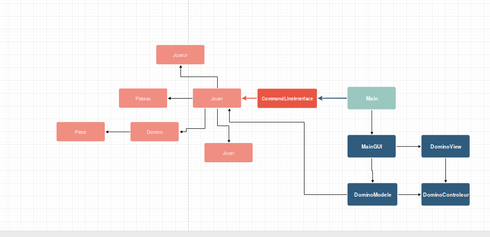

# Swing et Dominos

> Implémenation d'un jeu de domino et ses variantes en Java

---

[Nelson Perdriau](mailto:nelson.perdriau@etu.univ-paris-diderot.fr)

## Avant-propos

## Sommaire

* Réflexions sur la conception
* Parties traitées
* Choix d'architecture
* Problèmes connus
* Pistes à étudier
* Retour sur l'organisation collective
* Conclusion

### Réflexions sur la conception du jeu

Le jeu de domino se joue en général entre amis, sur une table. On peut jouer à 2,3 ou 4 amis. Le principe de base du domino se construit autour de pièces, ayant chacune 2 côtés.

On commence par avoir une vision aussi abstraite que possible du jeu, de façon à pouvoir implémenter ses variantes plus facilement, et éviter des erreurs d'architecture. Tout d'abord, commençont par la table.

La table sur laquelle nous allons jouer va donc être une liste double, dont la taille se décidera au début du jeu. Elle permettra de déterminer la position d'une pièce au court du jeu, mais nécéssitera l'implémentation d'une fonctionnalité qui vérifiera que l'on ne pause pas une pièce en dehors du plateau.

La pièce en elle-même sera un objet contenant une position et un ou plusieurs valeurs. Le domino sera lui constitué de deux pièces, avec en plus une orientation qui déterminera comment les deux pièces sont positionnées l'une par rapport à l'autre.  

Le jeu se joue au tour par tour. Il convient donc de mettre en place une face de distribuer les differents tours aux joueurs. Il convient donc de réfléchir à la conception du joueur.

### Parties traitées

Notre partie de Domino fonctionne, et permet de jouer à un jeu de Domino en ligne de commande. Les autres parties n'ont pas été traitées pour les raisons cité dans la partie [Retour sur l'organisation collective](Retour sur l'organisation collective).

Le jeu de domino est intéressant d'un point de vu logique. Il est assez flexible, dans le sens où l'on peut y jouer avec un minimum de règles pouvant évoluer sans changer la nature du jeu. Il est également assez simple à mettre en place.

La réalisation du Domino s'est également faite avec la possibilité d'étendre la logique sans tout changer au cours du développement. Par exemple pour implémenter une interface ActivityPub et pouvoir jouer depuis des réseaux sociaux.

### Choix d'architecture

L'architecture de notre code est structurée comme un arbre, dont la classe Main est la racine. À partir de là, les classes les plus importantes se voient découpées en fonctions, faisant elles-mêmes appels à d'autres classes.

Afin d'avoir une vision globale plus simple, nous avons réaliser ce schéma :

Cette architecture est simple, car elle séparer bien les éléments graphiques de la logique du jeu, autant en ligne de commande que en interface graphique. Elle peux tout à fait servir à créer des variantes avec des nouvelles classes, comme par exemple un jeu de puzzle.

Le choix d'avoir dès le début un plateau dont la taille est interchangeable nous permet d'avoir dans Jouer une logique assez simple, avec quelques fonctions uniquement. Le plus lourd se fait des les classes Joueur et Plateau, le reste étant surtout des types de données ( comme Domino ), qui n'ont pas d'existence en dehors des types de données qu'ils contiennent, étant sans logique.

### Problèmes connues

Étant donne la simplicitée de ce projet, nous avons surtout eu des soucis d'organisation, mais la logique du code ne nous as pas pausé de gros soucis. Le seul soucis à ce jour est le manque de rigeur quand à l'acceptation des données que le jouer entre en ligne de commande. Par exemple, si il rentre un Int au lieu d'un String, le programme s'arrête. On aurait pu résoudre ce problème en utilisant une classe qui se charge de prendre le contenue du Scanner, et grâce à un opérateur Diamant, déterminer le type d'entrée pour renvoyer une erreur sans planter.

### Pistes à étudier

Évidemment, la première piste à étudier serait de finir le projet tel que demandé.

Une autre piste qui pourrait être intéressante, étant donnée l'architecture modulable du code, serait de faire en sorte de pouvoir jouer à plusieurs. On pourrait en effet créer une classe qui se chargerait d'exposer la partie plateau / domino, et qui génererait des dominos pour les joueurs. Eux se connecterait à cette classe grâce à un client légér qui se chargerait simplement, comme CommandLineInterface, d'afficher les positions et de récuperer les décisions des joueurs.

### Retour sur l'organisation collective

Le plus gros soucis de ce projet, et qui explique en grande partie l'état embryonnaire, fut l'organisation collective. Les premières lignes de code furent écritent peu après l'annonce du projet. Mais, entre-temps, des vacances impromptu, une assiduitée légère et un niveau globalement insuffisant en Java d'une partie de l'équipe empêcha l'autre partie d'avancer, n'ayant pas de structure commune pour décider de l'organisation du code. La charge de travail fut également importante, mais inégalement répartie. La plus grosse partie du travail, autant la réflexion sur l'organisation du code que sur l'écriture de celui-ci à proprement parler, fut réalisée par une partie quasi-autonome.

Il en résultat la confusion entre les deux parties, et de fait, un code qui devait être réécrit à chaque fois. Même dans certains ajouts assez léger, un simple manque de compétance rendit extrêment compliqué la progression du projet.

## Conclusion

Ce projet à été compliqué à réaliser pour plusieurs raisons. La première fut bien sûr une mauvaise organisation et une mauvaise compréhension dans le groupe de travail. D'autre part, un manque de cours sur les interfaces graphiques par rapport au niveau demandé à rendu la tâche compliquée.

Nous avons toutefois appris sur nous-même, et développer nos compétances à écrire du code de bonne qualité. L'utilisation de la javadoc à été assez utilie pour nous. L'utilisation d'un gestionnaire de versions à également été utile pour nous permettre de nous retrouver dans nos changements.
